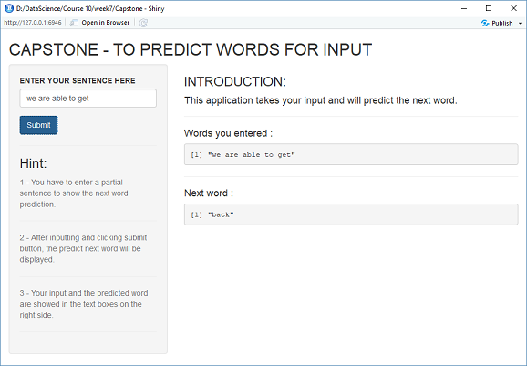

---
title: "Capstone Project"
author: "Gongyao Wang"
date: "April 24, 2018"
subtitle:  An application that employs Natural Language Processing techniques to predict next word.
transition: zoom
output: ioslides_presentation
---

```{r setup, include=FALSE}
knitr::opts_chunk$set(echo = FALSE)
```


## OVERVIEW
- The goal of this capstone project is to develop a Shiny appication that can predict the next word based on the inputs.

- The data was downloaded from [Capstone Dataset](https://d396qusza40orc.cloudfront.net/dsscapstone/dataset/Coursera-SwiftKey.zip) with three types of files (Blogs, Twitter, and News) in different languages. Here the English version was used.

- Several tasks were completed: (1) Understanding the problem, getting and cleaning the data;  (2) Doing exploratory data analysis; (3) Tokenization of words and predictive text mining; (4) Writing a milestone project and creating a prediction model; (5) Developing a shiny application and this introduction presentation.

- The Shiny application can be loaded from this link: [Capstone application](https://gwangshare.shinyapps.io/Capstone/)


## METHODS AND APPROACHING
- A sample from the original data (blogs, twitter, and news) was created, cleaned and prepared to be used as a corpus of text. It was converted to lower case, removed the punctuation, links, white space, numbers and profanity words.

- The sample text was tokenized into  n-grams to construct the predictive models. Tokenization is the process of breaking a stream of text up into words, phrases and N-gram is a contiguous sequence of n items from a given sequence of text.

- The corresponding n-grams files (unigram, bigram, trigram and quadgram) are created with frequencies of words, which will be used into the algorithm to predict the next word based on the input text.
 
 
## THE SHINY APPLICATION 
- The Shiny application offers the prediction for the next word based on the inputs. 

- The user enters words in an input box in the left pane. In the right pane, the application returns the input and the most possible next word.

- The predicted word is obtained from the n-grams matrices with the following sequences: quadgram, trigram, and bigram. 

- After entering the text, "submit" button need to be clicked to get the predicted next word and then the predicted word is provided for the user. 


## THE APP USER INTERFACE
- A Shiny application was created to provide the prediction of the next word based on the input shown as follows.


